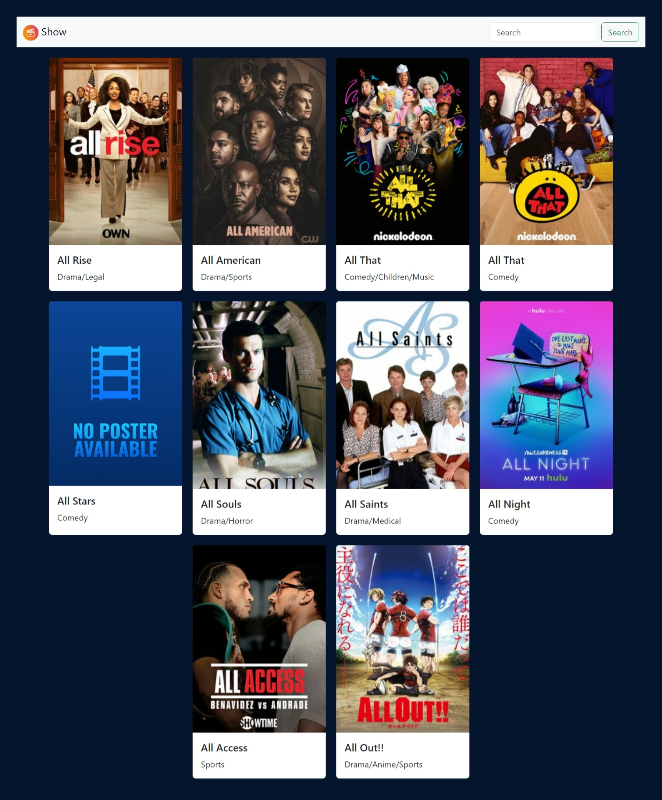
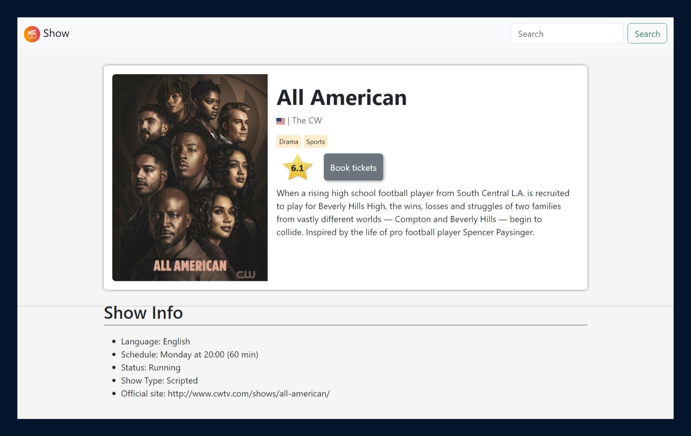

# TVMaze Show Project

Welcome to the TVMaze Show Project! This React JS application allows you to explore TV shows using the TVMaze API. The project includes two screens - one for displaying show information and another for show details and booking movie tickets.

## Getting Started

Before running the application, make sure you have Node.js installed on your machine. Clone the repository and run the following commands in the project directory:

```bash
npm install
npm run dev
```

This will install the necessary dependencies and start the development server.

## Package.json Details

The project is configured with the following `package.json` details:

```json
{
  "name": "tvmaze-show-project",
  "private": true,
  "version": "0.0.0",
  "type": "module",
  "scripts": {
    "dev": "vite",
    "build": "vite build",
    "lint": "eslint . --ext js,jsx --report-unused-disable-directives --max-warnings 0",
    "preview": "vite preview"
  },
  "dependencies": {
    "bootstrap": "^5.3.2",
    "react": "^18.2.0",
    "react-country-flag": "^3.1.0",
    "react-dom": "^18.2.0"
  },
  "devDependencies": {
    "@types/react": "^18.2.43",
    "@types/react-dom": "^18.2.17",
    "@vitejs/plugin-react": "^4.2.1",
    "eslint": "^8.55.0",
    "eslint-plugin-react": "^7.33.2",
    "eslint-plugin-react-hooks": "^4.6.0",
    "eslint-plugin-react-refresh": "^0.4.5",
    "react-router-dom": "^6.21.3",
    "vite": "^5.0.8"
  }
}
```

## Features

- **Two Screens:**
  - Home: Display information about TV shows based on the search query.
  - Details: Show detailed information about a specific TV show and allow users to book movie tickets.

- **API Integration:**
  - Utilizes the TVMaze API to fetch real-time data about TV shows.

- **User Interaction:**
  - Search bar to dynamically update the displayed shows.
  - Button to book movie tickets with a pre-filled form for the selected show.

- **Local Storage:**
  - Stores user details locally to avoid page reloads.

- **UI/UX:**
  - Basic HTML and CSS styling with Bootstrap for a clean and visually appealing design.

## Screenshots




## Usage

1. Navigate to the Home screen to explore Shows.
2. Click on a show to view detailed information on the Details screen.
3. On the Details screen, click the "Book Ticket" button to open a form with pre-filled details.
